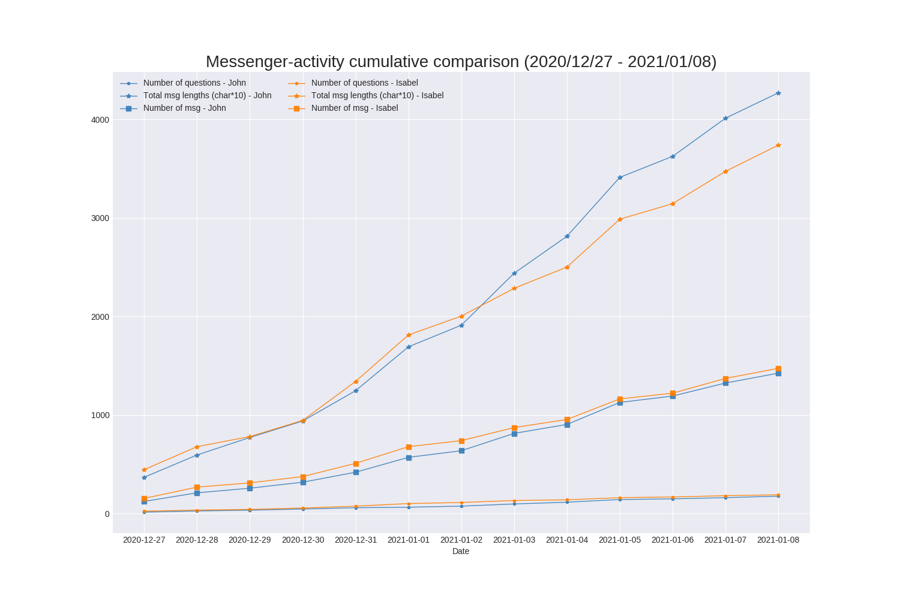
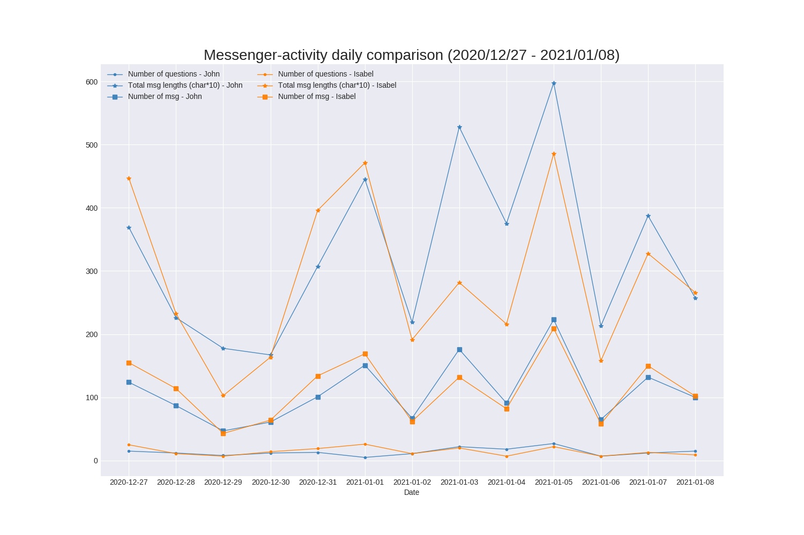

# Messenger activity comparator
Compares conversation-activity in a given period from Facebook messenger between two senders.

## Usage:

1. Within your Facebook's "Settings" page, click on „Your Facebook Information“ then on „Download a copy of your information…“.
2. Click on "Deselect All" and then select only the "Messages" field. 
3. On the upper area define the desired time interval where the messages are needed to be compared and choose the format "JSON" and click "Download".
4. After the download finished, open up the **main.py** file and modify the *SETTINGS* and *JSON_PATH* variables. 
   1. Modify the fields in *SETTINGS* according to the sender names and desired nicknames.
   2. Modify the *JSON_PATH* variable according to your downloaded file location.
5. Run the file: _python main.py_ 

_Notes:_ 
* _For the sender name it is enough to provide either the first or second name._
* _The name of the output file can also be modified as a function argument._

The next images show the two outputs: **daily** and **cumulative** statistics.
Both statistics include:
* Daily/cumulative comparison of total message lengths
* Daily/cumulative comparison of number of questions asked
* Daily/cumulative comparison of number of messages

